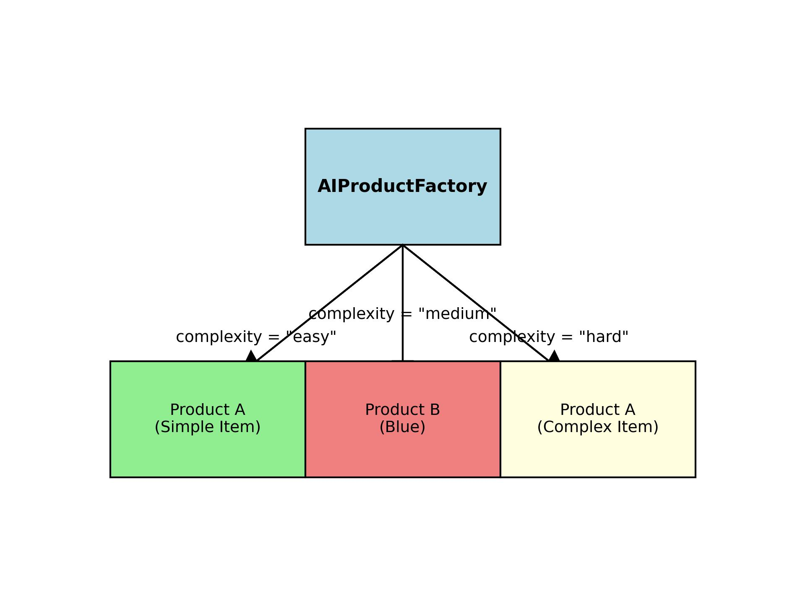

# The AI Impact on Design Patterns

## Table of Contents

- [Introduction](#introduction)
- [Factory Pattern: AI-Powered Model Selection](#1-factory-pattern-ai-powered-model-selection)
- [Singleton Pattern: AI Model Caching](#2-singleton-pattern-ai-model-caching)
- [Adapter Pattern: AI API Integration](#3-adapter-pattern-ai-api-integration)
- [Decorator Pattern: AI-Based Feature Augmentation](#4-decorator-pattern-ai-based-feature-augmentation)
- [Observer Pattern: AI-Driven Event Handling](#5-observer-pattern-ai-driven-event-handling)
- [Builder Pattern: AI-Driven Configuration](#6-builder-pattern-ai-driven-configuration)
- [Strategy Pattern: AI Dynamic Decision-Making](#7-strategy-pattern-ai-dynamic-decision-making)
- [Chain of Responsibility](#8-chain-of-responsibility-ai-enhanced-request-handling)
- [Conclusion](#conclusion)
- [Feedback & Next Steps](#feedback--next-steps)

## Introduction

Design patterns are well-established solutions to common software design problems. With the emergence of Artificial Intelligence (AI), these patterns are evolving to accommodate dynamic, data-driven decision-making. AI enhances traditional design patterns by introducing adaptability, automation, and predictive capabilities.

This article explores how AI influences popular design patterns, with real-world examples and illustrations.

To avoid a too big article, I will only cover the following patterns: Factory, Singleton, Adapter, Decorator, Observer, Builder, Strategy, and Chain of Responsibility. You can find more patterns in my repo, here.

---

## 1. Factory Pattern: AI-Powered Model Selection

### **Traditional Use**

The Factory Pattern creates objects without specifying the exact class.

### **AI Enhancement**

AI dynamically selects and optimizes object creation based on conditions such as workload, data type, or environment.

**Example:** A system selects and loads the best AI model based on input data.

```python
import matplotlib.pyplot as plt

# 1.1 The Factory Method Pattern (Basic Example)

class ProductA:
    def __init__(self, name):
        self.name = name

    def display(self):
        print(f"Product A: {self.name}")


class ProductB:
    def __init__(self, color):
        self.color = color

    def display(self):
        print(f"Product B: Color - {self.color}")


class AbstractFactory:
    def create_product(self):
        raise NotImplementedError("Subclasses must implement this method")

class ConcreteFactoryA(AbstractFactory):
    def create_product(self):
        return ProductA("Item A")

class ConcreteFactoryB(AbstractFactory):
    def create_product(self):
        return ProductB("Red")


# 1.2. Enhancing with AI -  Dynamic Product Creation based on Input

import random

class AIProductFactory(AbstractFactory):
    def __init__(self, complexity="medium"):
        self.complexity = complexity # Let's assume "easy", "medium", or "hard"

    def create_product(self):
        if self.complexity == "easy":
            return ProductA("Simple Item")  # Easy product
        elif self.complexity == "medium":
            return ProductB("Blue") # Medium complexity product
        elif self.complexity == "hard":
            # Simulate AI decision making (e.g., based on some data)
            if random.random() < 0.7:  # 70% chance of a complex product
                return ProductA("Complex Item")
            else:
                return ProductB("Green") # Other wise, return another B
        else:
            print(f"Unknown complexity level: {self.complexity}. Defaulting to medium.")
            return ProductB("Blue")


# 1.3. Usage: Traditional Example

factory_a = ConcreteFactoryA()
product1 = factory_a.create_product()
product1.display()

factory_b = ConcreteFactoryB()
product2 = factory_b.create_product()
product2.display()

# 1.4. Usage: AI Enhanced Example

factory_a = AIProductFactory(complexity="hard")
product1 = factory_a.create_product()
product1.display()

factory_b = AIProductFactory(complexity="easy")
product2 = factory_b.create_product()
product2.display()

```



- A decision tree that routes requests to the best-fit AI model.

### **1.5. Explanation**

1. **Traditional Use**: The Factory Method is a *template method*. It defines the overall structure of the object creation, but it relies on subclasses (the concrete factories) to provide the actual implementation details. There is no dynamic choice.
2. **AI Enhancement**: The AI factory dynamically chooses which product to create, hiding the concrete factory implementation from the client.


---

## 2. Singleton Pattern: AI Model Caching

### **Traditional Use**

Ensures that a class has only one instance and provides a global point of access.

### **AI Enhancement**

AI-based services may cache and reuse model instances based on demand, optimizing performance.

```python
class AIModelSingleton:
    _instance = None

    def __new__(cls, model_name):
        if cls._instance is None:
            print("Loading AI model...")
            cls._instance = super(AIModelSingleton, cls).__new__(cls)
            cls._instance.model_name = model_name
        return cls._instance

model1 = AIModelSingleton("GPT-4")
model2 = AIModelSingleton("GPT-4")

print(model1 is model2)  # True
```


- AI-powered recommendation system caching a single instance of a model to avoid redundant loads.

---

## 3. Adapter Pattern: AI API Integration

### **Traditional Use**

Converts the interface of a class into another interface expected by the client.

### **AI Enhancement**

Facilitates seamless integration between AI models and legacy systems.

```python
class OldPredictionSystem:
    def classify(self, input_data):
        return "Old System Classification"

class AIAdapter:
    def __init__(self, old_system):
        self.old_system = old_system
    
    def predict(self, data):
        return self.old_system.classify(data)

old_system = OldPredictionSystem()
adapter = AIAdapter(old_system)
print(adapter.predict("input data"))
```


- Adapter acting as a bridge between a traditional rule-based system and an AI-powered model.
- Dynamic Behavior: Unlike traditional adapters that simply translate interfaces, AI adapters can:
  - Pre-process data for AI models
  - Post-process AI model outputs to match legacy system expectations
  - Handle data format conversions between different systems

---

## 4. Decorator Pattern: AI-Based Feature Augmentation

### **Traditional Use**

Dynamically extends the behavior of an object.

### **AI Enhancement**

AI enhances functionalities by adding features like predictive analytics or anomaly detection.

```python
class BaseClassifier:
    def classify(self, data):
        return "Base classification"

class AIEnhancedClassifier:
    def __init__(self, classifier):
        self.classifier = classifier
    
    def classify(self, data):
        base_result = self.classifier.classify(data)
        return f"{base_result} with AI Enhancement"

classifier = BaseClassifier()
ai_classifier = AIEnhancedClassifier(classifier)
print(ai_classifier.classify("data"))
```


- A base classifier wrapped with AI-based sentiment analysis.

**Overall Flow:**
1. The client sends a request to the **AIEnhancedClassifier**.
2. The **AIEnhancedClassifier** delegates the base classification task to the **BaseClassifier**.
3. The **BaseClassifier** processes the data and returns the result to the **AIEnhancedClassifier**.
4. The **AIEnhancedClassifier** sends the result to the **AI Enhancement Layer** for additional AI-based processing.
5. The **AI Enhancement Layer** returns the enhanced output to the **AIEnhancedClassifier**, which then provides the final result to the client.

---

## 5. Observer Pattern: AI-Driven Event Handling

### **Traditional Use**

Allows objects to subscribe to events and receive notifications.

### **AI Enhancement**

AI analyzes event streams to detect anomalies and filter unnecessary alerts.

```python
class Observer:
    def update(self, event_data):
        pass

class SecuritySystem:
    def __init__(self):
        self._observers = []

    def add_observer(self, observer):
        self._observers.append(observer)

    def notify_observers(self, event_data):
        if AIThreatAnalyzer.is_real_threat(event_data):
            for observer in self._observers:
                observer.update(event_data)

class SecurityAlert(Observer):
    def update(self, event_data):
        print(f"Security Alert: {event_data}")

class AIThreatAnalyzer:
    @staticmethod
    def is_real_threat(event_data):
        return "malware" in event_data.lower()
```

```bash
# Generate the AI Observer diagram
python draw_ai_observer.py
```


- AI-powered cybersecurity system filtering security events.

**Overall Flow:**
1. The client sends `Event Data` → SecuritySystem (input arrow on the left).
2. SecuritySystem → AIThreatAnalyzer (`is_real_threat()` call, top middle arrow).
3. SecuritySystem → SecurityAlert (`notify_observers()` call, bottom middle arrow).
4. SecurityAlert → client (`Alert` output arrow on the right).

---

## 6. Builder Pattern: AI-Driven Configuration

### **Traditional Use**

Builds complex objects step by step.

### **AI Enhancement**

AI dynamically selects configurations based on performance data.

```python
class AIModelBuilder:
    def __init__(self):
        self.model = {}
    
    def set_layers(self, layers):
        self.model["layers"] = layers
        return self
    
    def set_optimizer(self, optimizer):
        self.model["optimizer"] = optimizer
        return self
    
    def build(self):
        return self.model

builder = AIModelBuilder()
model = builder.set_layers(3).set_optimizer("Adam").build()
print(model)
```

**Illustration:**


- AI auto-configuring neural network hyperparameters.

**Overall Flow:**
1. Client sends `Config Params` → AIModelBuilder (input arrow on the left).
2. AIModelBuilder calls `set_layers()` and `set_optimizer()` (vertical arrows on the builder box).
3. AIModelBuilder → Model (`build()` call, horizontal arrow).
4. Model → client (output arrow on the right).

---

## 7. Strategy Pattern: AI Dynamic Decision-Making

### **Traditional Use**

Encapsulates different algorithms and allows them to be used interchangeably.

### **AI Enhancement**

AI selects the best strategy dynamically.

```python
class Strategy:
    def recommend(self, user_data):
        pass

class ContentBased(Strategy):
    def recommend(self, user_data):
        return "Content-based recommendation"

class CollaborativeFiltering(Strategy):
    def recommend(self, user_data):
        return "Collaborative filtering recommendation"
```

```bash
# Generate the AI Strategy diagram
python draw_ai_strategy.py
```


- AI choosing the best recommendation approach.

**Overall Flow:**
1. Client sends `user_data` → chosen strategy (input arrow on the left).  
2. Strategy executes `recommend(user_data)`.  
3. Strategy returns recommendation → client (output arrow on the right).

**AI Enhancement:**
- The Strategy Pattern enables dynamic selection among multiple algorithms.
- In a real-world AI system, `user_data` (e.g., preferences, behavior) would feed into ML or heuristic models within each strategy.
- The client or a controller could automatically pick or weight strategies based on data-driven insights, making recommendations adaptive and personalized.

---

## 8. Chain of Responsibility: AI-Enhanced Request Handling

### **Traditional Use**

Allows a request to be passed along a chain of handlers until one handles it.

```python
# ai_chain_of_responsibility.py
class Handler:
    def __init__(self, successor=None):
        self.successor = successor

    def handle(self, request):
        if self.can_handle(request):
            return f"Handled by {self.__class__.__name__}"
        elif self.successor:
            return self.successor.handle(request)
        return "Request not handled"

    def can_handle(self, request):
        raise NotImplementedError()

class ConcreteHandlerA(Handler):
    def can_handle(self, request):
        return request < 10

class ConcreteHandlerB(Handler):
    def can_handle(self, request):
        return 10 <= request < 20

class ConcreteHandlerC(Handler):
    def can_handle(self, request):
        return request >= 20

# Traditional usage
target_chain = ConcreteHandlerA(ConcreteHandlerB(ConcreteHandlerC()))
for r in [5, 15, 25]:
    print(f"Request: {r} -> {target_chain.handle(r)}")
```

### **AI Enhancement**

AI dynamically selects the best handler based on request characteristics.

```python
# ai_chain_of_responsibility.py (AI-Enhanced usage)
import random

class AIHandler:
    def __init__(self, handlers):
        self.handlers = handlers

    def handle(self, request):
        selected = max(self.handlers, key=lambda h: random.random())
        return f"AI selected {selected.__class__.__name__} -> {selected.handle(request)}"

handlers = [ConcreteHandlerA(), ConcreteHandlerB(), ConcreteHandlerC()]
ai_handler = AIHandler(handlers)
for r in [5, 15, 25]:
    print(f"AI Request: {r} -> {ai_handler.handle(r)}")
```

```bash
# Generate the AI Chain of Responsibility diagram
python draw_ai_chain_of_responsibility.py
```


- AI-enhanced chain that learns optimal handler selection from data.

**Overall Flow:**
- **Traditional Chain:**
  1. Client sends `request` to **Handler A**.
  2. **Handler A** processes (`can_handle`) or forwards to **Handler B**.
  3. **Handler B** processes or forwards to **Handler C**.
  4. **Handler C** processes if possible; otherwise request is unhandled.
- **AI-Enhanced Chain:**
  1. Client sends `request` to **AI Selector** node.
  2. **AI Selector** predicts the best handler based on request data.
  3. Predicted **Handler** executes `handle(request)` and returns result.

---

## Conclusion

AI is revolutionizing design patterns by making them dynamic, adaptive, and data-driven. By integrating AI, software architectures become more intelligent, scalable, and efficient.

---

## Feedback & Next Steps

- Add a **Table of Contents** at the top for quick navigation to each pattern.
- Provide live links to example scripts (`draw_ai_*.py` and `ai_*.py`) in the repo.
- Include a small **Prerequisites** section (e.g., Python, Matplotlib) and how to install them (`pip install matplotlib`).
- Consider adding a **Chain of Responsibility** example or linking to it if implemented elsewhere.
- Ensure all image filenames and references are consistent (e.g., `_diagram.jpg` vs. `.jpg`).
- Add code snippets that show how to select AI‑enhanced vs. traditional implementations at runtime.
- Offer pointers to further reading or related patterns (e.g., MVC, Command) for readers who want to explore more.

